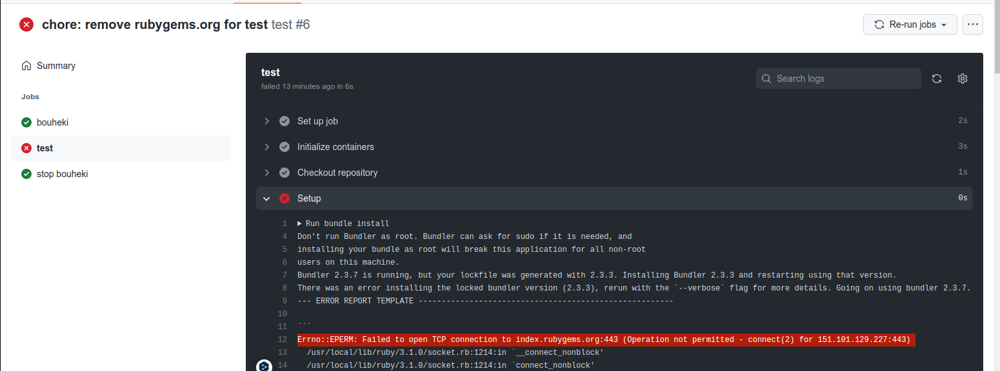

# bouheki-runner

⚠ WIP ⚠

bouheki-runner is security audit agent on the GitHub Actions Self-hosted runner to prevent data exfiltration.  
Protects against supply chain attacks and other attacks by hijacked dependent libraries.

## Using bouheki-runner

0. Make sure Self-hosted Runner satisfy the conditions for bouheki to work

ref. https://blog.ssrf.in/bouheki/getting-started/installation/

1. Add `mrtc0/bouheki-runner` to your GitHub Actions Workflow file as the first step.

```yaml
bouheki:
  name: "bouheki"
  runs-on: self-hosted
  steps:
    - uses: mrtc0/bouheki-runner@master
      with:
        allowed-endpoints: '127.0.0.11/32,10.0.2.1/24,rubygems.org'
        mode: 'block'
        target: 'container'
        service_action: 'start'
```

2. Other jobs can use the `needs` option to be executed after bouheki is executed.

```yaml
test:
  name: "test"
  runs-on: self-hosted
  container:
    image: rubylang/ruby:3.1.1-focal
  needs: bouheki
  steps:
  - name: Checkout repository
    uses: actions/checkout@v2

  - name: Setup
    run: bundle install

  - name: Run test
    run: bundle exec rspec spec
```

3. Finally, perform a cleanup process

```yaml
bouheki_stop:
  name: "stop bouheki"
  runs-on: self-hosted
  if: always()
  needs: test
  steps:
    - name: Stop bouheki
      run: sudo systemctl stop bouheki
```

### Full Example

```yaml
name: "test"

on:
  push:

jobs:
  bouheki:
    name: "bouheki"
    runs-on: self-hosted
    steps:
      - uses: mrtc0/bouheki-runner@master
        with:
          allowed-endpoints: '127.0.0.11/32,10.0.2.1/24,rubygems.org' # DNS Servers, rubygems.org
          mode: 'block'
          target: 'container'
          service_action: 'start'

  test:
    name: "test"
    runs-on: self-hosted
    container:
      image: rubylang/ruby:3.1.1-focal
    needs: bouheki
    steps:
    - name: Checkout repository
      uses: actions/checkout@v2

    - name: Setup
      run: bundle install

  bouheki_stop:
    name: "stop bouheki"
    runs-on: self-hosted
    if: always()
    needs: test
    steps:
      - name: Stop bouheki
        run: sudo systemctl stop bouheki

```

For example, excluding `rubygems.org` from `allowed-endpoints` will cause bundle install to fail.



Then a log is logged in which bouheki blocks the connection.

```json
$ cat /var/log/bouheki.log
...
{"Action":"BLOCKED","Addr":"151.101.129.227","Comm":"bundle","Hostname":"75f2194bbe3e","PID":32662,"ParentComm":"sh","Port":443,"Protocol":"UDP","level":"info","msg":"Traffic is trapped in the filter.","time":"2022-03-18T15:36:14Z"}
{"Action":"BLOCKED","Addr":"151.101.65.227","Comm":"bundle","Hostname":"75f2194bbe3e","PID":32662,"ParentComm":"sh","Port":443,"Protocol":"TCP","level":"info","msg":"Traffic is trapped in the filter.","time":"2022-03-18T15:36:14Z"}
{"Action":"BLOCKED","Addr":"151.101.193.227","Comm":"bundle","Hostname":"75f2194bbe3e","PID":32662,"ParentComm":"sh","Port":443,"Protocol":"TCP","level":"info","msg":"Traffic is trapped in the filter.","time":"2022-03-18T15:36:14Z"}
{"Action":"BLOCKED","Addr":"151.101.1.227","Comm":"bundle","Hostname":"75f2194bbe3e","PID":32662,"ParentComm":"sh","Port":443,"Protocol":"TCP","level":"info","msg":"Traffic is trapped in the filter.","time":"2022-03-18T15:36:14Z"}
{"Action":"BLOCKED","Addr":"151.101.129.227","Comm":"bundle","Hostname":"75f2194bbe3e","PID":32662,"ParentComm":"sh","Port":443,"Protocol":"TCP","level":"info","msg":"Traffic is trapped in the filter.","time":"2022-03-18T15:36:14Z"}
```

# References

- https://github.com/mrtc0/bouheki
- https://blog.ssrf.in/bouheki/
